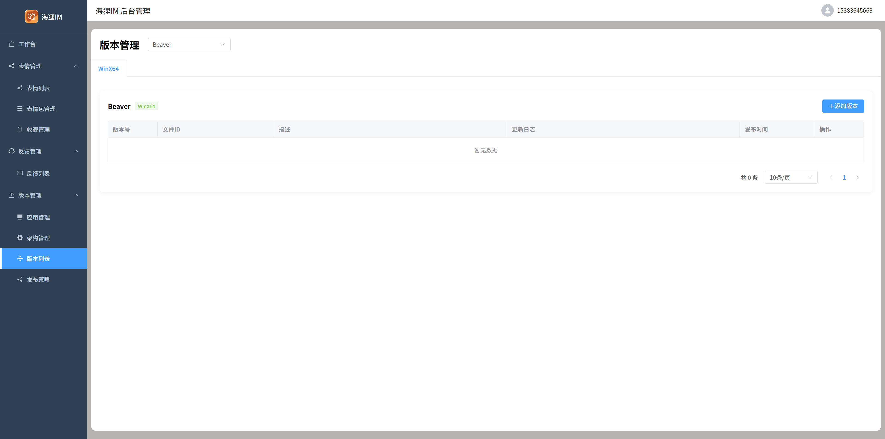
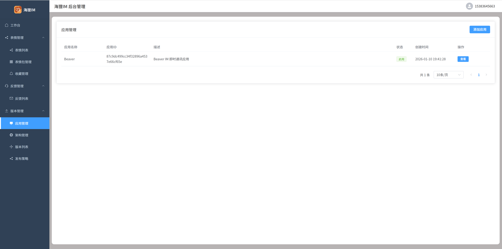
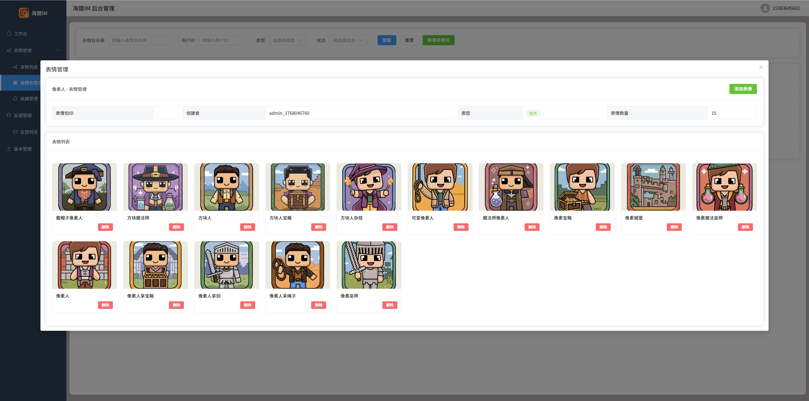

# 🦫 Beaver Manager - Beaver IM Admin System

[](LICENSE)
[](https://vuejs.org/)
[](https://element-plus.org/)
[](https://www.typescriptlang.org/)
[](https://qm.qq.com/q/82rbf7QBzO)

> 🚀 **Modern Admin Management System** - Built with Vue 3 + Element Plus + TypeScript, providing comprehensive management and monitoring for Beaver IM

[中文](README.md) | [English](README_EN.md)

---

## ✨ Core Features

- 👥 **User Management** - User information management, permission control, account status management
- 💬 **Chat Management** - Chat records viewing, content moderation, sensitive word filtering
- 👨‍👩‍👧‍👦 **Group Management** - Group creation review, member management, group settings configuration
- 😀 **Emoji Management** - Emoji package review, category management, version control
- 🔄 **Version Management** - App update release, version control, gray release
- 📊 **Data Statistics** - User activity analysis, message statistics, system monitoring
- 🔧 **System Settings** - Parameter configuration, feature toggles, role permissions management
- 🎨 **Modern UI** - Beautiful interface design based on Element Plus

## 🛠️ Technology Stack

| Technology | Version | Description |
|------------|---------|-------------|
| **Vue.js** | 3.5+ | Progressive JavaScript Framework |
| **TypeScript** | 5.8+ | Type Safety |
| **Element Plus** | 2.10+ | Vue 3 Component Library |
| **Vite** | 7.0+ | Next Generation Frontend Build Tool |
| **Pinia** | 3.0+ | Vue State Management |
| **Vue Router** | 4.5+ | Official Routing Manager |
| **Axios** | 1.10+ | HTTP Client |

## 📊 Feature Showcase

### 🔄 Version Management
<div align="center">
  
  
  
</div>

### 😀 Emoji Management
<div align="center">
  
  
  
</div>

## 🚀 Quick Start

### Environment Requirements
- Node.js >= 18.0.0

### Installation Steps
```bash
# Clone the project
git clone https://github.com/wsrh8888/beaver-manager.git
cd beaver-manager

# Install dependencies
npm install

# Start development server
npm run dev

# Build for production
npm run build_prod

# Build for testing
npm run build_test
```

### Environment Configuration
1. Create `.env.development` file (development environment)
2. Create `.env.test` file (testing environment)
3. Create `.env.production` file (production environment)

For detailed configuration, please refer to [Environment Configuration Documentation](https://wsrh8888.github.io/beaver-docs/manager/config).

## 🔗 Related Projects

| Project | Repository | Description |
|---------|------------|-------------|
| **beaver-server** | [GitHub](https://github.com/wsrh8888/beaver-server) \| [Gitee](https://gitee.com/dawwdadfrf/beaver-server) | Backend Service |
| **beaver-mobile** | [GitHub](https://github.com/wsrh8888/beaver-mobile) \| [Gitee](https://gitee.com/dawwdadfrf/beaver-mobile) | Mobile Application |
| **beaver-desktop** | [GitHub](https://github.com/wsrh8888/beaver-desktop) \| [Gitee](https://gitee.com/dawwdadfrf/beaver-desktop) | Desktop Application |
| **beaver-manager** | [GitHub](https://github.com/wsrh8888/beaver-manager) | Admin Management System |

## 📚 Documentation & Help

- 📖 **Detailed Documentation**: [Beaver IM Documentation](https://wsrh8888.github.io/beaver-docs/)
- 🎥 **Video Tutorials**: [Bilibili Tutorials](https://www.bilibili.com/video/BV1HrrKYeEB4/)
- 📱 **Mobile Experience APK**: [Android Experience Package](https://github.com/wsrh8888/beaver-docs/releases/download/lastest/latest.apk)
- 💬 **QQ Group**: [1013328597](https://qm.qq.com/q/82rbf7QBzO)

## 🤝 Contributing

We welcome all forms of contributions!

1. Fork this repository
2. Create a feature branch (`git checkout -b feature/AmazingFeature`)
3. Commit changes (`git commit -m 'Add some AmazingFeature'`)
4. Push to branch (`git push origin feature/AmazingFeature`)
5. Open a Pull Request

## ⭐ Support the Project

If this project helps you, please give us a ⭐ Star!

## ☕ Buy the Developer a Coffee

If this project helps you, feel free to buy the developer a coffee ☕

<div align="center">
  
  
</div>

## 📄 Open Source License

This project is licensed under the [MIT](LICENSE) License.

## ⭐ Star History

[](https://star-history.com/#wsrh8888/beaver-manager&Date)

---

<div align="center">
  <strong>Made with ❤️ by Beaver IM Team</strong><br>
  <em>Enterprise Instant Messaging Platform Admin Management System</em>
</div>