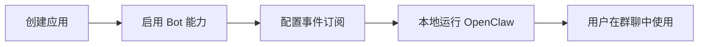

# Beaver 开放平台使用指南

## 📖 核心概念

### 什么是开放平台？

开放平台允许第三方开发者创建应用，通过 API 与你的 IM 系统交互。主要提供三种能力：

1. **Bot 机器人** - 在 IM 中与用户对话的 AI 助手
2. **OAuth 登录** - 让其他网站使用你的 IM 账号快捷登录（类似 QQ/微信扫码）
3. **Webhook 事件订阅** - 实时接收 IM 中的消息、好友申请等事件

---

## 🎯 典型使用场景

### 场景 1：创建 AI 聊天机器人（OpenClaw）

**需求：** 我想在群里添加一个 AI 机器人，可以回答问题、执行任务。

**步骤：**



#### 详细操作：

**第 1 步：在开放平台创建应用**
1. 登录开放平台控制台
2. 点击"创建应用"
3. 填写应用名称："我的 AI 助手"
4. 上传图标、填写描述
5. 点击"创建"

**第 2 步：配置 Bot 能力**
1. 进入应用详情页
2. 左侧菜单选择"机器人"
3. 开启"机器人能力"开关
4. 配置 Bot 信息：
   - Bot 名称：AI 助手
   - Bot 头像：上传头像 URL
   - Bot 简介："我是智能 AI 助手"
   - 允许单聊：✓
   - 允许群聊：✓
   - 允许 @ 提及：✓
5. 保存配置

**第 3 步：配置事件订阅**
1. 左侧菜单选择"事件与回调"
2. 选择"使用长连接接收事件"（推荐，无需公网 IP）
3. 勾选订阅事件：
   - ☑️ 接收消息
   - ☑️ 机器人进群
   - ☑️ 允许 @ 提及
4. 保存配置

**第 4 步：获取凭证**
1. 左侧菜单选择"凭证与基础信息"
2. 复制 App ID 和 App Secret
   ```
   App ID: app_xxxxxxxxxx
   App Secret: xxxxxxxxxxxxxxxxxxxxxx
   ```

**第 5 步：配置 OpenClaw**
```bash
# 安装 OpenClaw
npm install -g openclaw

# 配置 Beaver 渠道
openclaw channels add beaver

# 输入凭证
? App ID: app_xxxxxxxxxx
? App Secret: xxxxxxxxxxxxxxxxxxxxxx

# 启动网关
openclaw gateway start
```

**第 6 步：在 IM 中使用**
1. 打开 IM 客户端
2. 进入"应用中心"或"机器人广场"
3. 找到"我的 AI 助手"
4. 添加到群聊
5. @机器人 提问："今天天气怎么样？"
6. OpenClaw 收到消息 → 调用 AI → 回复到群里

---

### 场景 2：第三方网站 OAuth 登录

**需求：** 我有一个网站，想让用户用 Beaver IM 账号扫码登录。

**步骤：**

#### 第 1 步：在开放平台配置 OAuth

1. 创建应用 "网站登录"
2. 左侧菜单选择"OAuth 登录"
3. 开启 OAuth 能力
4. 配置回调地址：
   ```
   https://mysite.com/auth/callback
   ```
5. 自定义授权页面（可选）：
   - Logo URL
   - 标题文字
   - 主题颜色
6. 保存配置

#### 第 2 步：在网站中集成

```javascript
// 1. 引导用户跳转到授权页面
const authUrl = `https://beaver.com/oauth/authorize?
  client_id=app_xxxxxxxxxx&
  redirect_uri=https://mysite.com/auth/callback&
  response_type=code&
  scope=openid,user_profile`

window.location.href = authUrl

// 2. 用户扫码授权后，跳转到回调地址
// 在回调页面接收 code
const urlParams = new URLSearchParams(window.location.search)
const code = urlParams.get('code')

// 3. 用 code 换取 access_token
const response = await fetch('https://beaver.com/oauth/token', {
  method: 'POST',
  headers: { 'Content-Type': 'application/json' },
  body: JSON.stringify({
    grant_type: 'authorization_code',
    code: code,
    client_id: 'app_xxxxxxxxxx',
    client_secret: 'YOUR_APP_SECRET',
    redirect_uri: 'https://mysite.com/auth/callback'
  })
})

const { access_token } = await response.json()

// 4. 用 token 获取用户信息
const userInfo = await fetch('https://beaver.com/oauth/userinfo', {
  headers: { 'Authorization': `Bearer ${access_token}` }
}).then(res => res.json())

console.log('用户信息:', userInfo)
// { userId: 'user_123', name: '张三', avatar: '...' }

// 5. 完成登录，创建会话
localStorage.setItem('token', access_token)
```

#### 第 3 步：用户体验流程

```
用户访问网站
  ↓
点击"使用 Beaver 登录"
  ↓
弹出二维码（或跳转授权页）
  ↓
用户用手机 Beaver IM 扫码
  ↓
确认授权
  ↓
网站自动登录成功
```

---

### 场景 3：企业微信/钉钉消息同步

**需求：** 我想把 Beaver 的消息同步到企业微信群。

**步骤：**

#### 第 1 步：配置 Webhook

1. 创建应用 "消息同步"
2. 左侧菜单选择"事件与回调"
3. 选择"使用开发者服务器回调"
4. 配置回调 URL：
   ```
   https://your-server.com/webhook
   ```
5. 勾选订阅事件：
   - ☑️ 接收消息
   - ☑️ 群组创建
6. 保存配置

#### 第 2 步：编写 Webhook 服务器

```javascript
const express = require('express')
const axios = require('axios')
const app = express()

app.use(express.json())

// 接收 Beaver 推送的消息
app.post('/webhook', async (req, res) => {
  const event = req.body
  
  // 验证签名
  if (!verifySignature(req)) {
    return res.status(401).send('Unauthorized')
  }
  
  // 处理消息事件
  if (event.type === 'im.message.receive_v1') {
    const message = event.data
    
    // 转发到企业微信
    await axios.post('https://qyapi.weixin.qq.com/cgi-bin/webhook/send', {
      msgtype: 'text',
      text: {
        content: `[Beaver] ${message.sender}: ${message.content}`
      }
    })
  }
  
  // 必须返回 200
  res.status(200).send('OK')
})

app.listen(3000)
```

#### 第 3 步：部署服务器

```bash
# 需要公网可访问的 HTTPS 地址
# 可以使用：
# - 云服务器（阿里云/腾讯云）
# - ngrok 内网穿透
# - Vercel/Netlify Serverless
```

---

## 🔑 核心概念详解

### 1. 应用 vs Bot

**问：应用和 Bot 是什么关系？**

**答：** 应用是容器，Bot 是应用的一种能力。

```
应用 (App)
├─ 凭证 (App ID + App Secret)
├─ 能力 1: Bot 机器人
│   ├─ Bot 名称
│   ├─ Bot 头像
│   └─ 能力配置（单聊/群聊/@提及）
├─ 能力 2: OAuth 登录
│   ├─ 回调地址
│   └─ 授权范围
└─ 能力 3: Webhook 事件订阅
    ├─ 订阅方式（长连接/Webhook）
    └─ 事件类型
```

**关键点：**
- ✅ 一个应用可以同时启用多种能力
- ✅ Bot 不是独立的用户账号，而是应用的身份
- ✅ 用户不需要"添加好友"，直接与应用对话

### 2. 长连接 vs Webhook

| 特性 | 长连接 (WebSocket) | Webhook (HTTP) |
|------|-------------------|----------------|
| **是否需要公网 IP** | ❌ 不需要 | ✅ 需要 |
| **适用场景** | 本地运行的服务（OpenClaw） | 云服务器部署的服务 |
| **稳定性** | 更高（持久连接） | 依赖网络质量 |
| **延迟** | 更低 | 稍高 |
| **配置复杂度** | 简单 | 复杂（需 HTTPS） |

**推荐使用长连接的情况：**
- ✅ 本地运行 OpenClaw
- ✅ 个人开发测试
- ✅ 没有公网服务器

**推荐使用 Webhook 的情况：**
- ✅ 企业级应用
- ✅ 已有云服务器
- ✅ 需要高可用性

### 3. 应用状态流转

```
草稿 (status=0)
  ↓ 发布
已发布 (status=1) ← 用户可以搜索到
  ↓ 禁用
已禁用 (status=2)
```

**版本管理流程：**
```
创建版本 (v1.0.0)
  ↓
提交审核
  ↓
审核中
  ↓
审核通过 / 审核拒绝
  ↓
发布上线
```

---

## 💡 常见问题

### Q1: 为什么我的 Bot 收不到消息？

**检查清单：**
1. ✅ Bot 能力是否已启用？
2. ✅ 是否订阅了"接收消息"事件？
3. ✅ 如果使用 Webhook，URL 是否正确且可访问？
4. ✅ 如果使用长连接，WebSocket 是否已连接？
5. ✅ 应用是否已发布？（草稿状态不可用）

### Q2: OpenClaw 如何接入？

**最简单的方式（推荐）：**
```bash
# 1. 选择长连接模式（无需公网 IP）
# 2. 在开放平台配置事件订阅
# 3. 运行 OpenClaw 网关
openclaw gateway start

# 4. 在 IM 中与 Bot 对话即可
```

### Q3: 如何实现类似 QQ 扫码登录？

**答案：** 使用 OAuth 能力。

1. 在开放平台启用 OAuth
2. 配置回调地址
3. 在前端生成授权链接
4. 用户扫码授权
5. 用 code 换取 token
6. 获取用户信息完成登录

详见"场景 2"的完整代码示例。

### Q4: 如何调试 Webhook？

**方法 1：使用日志**
- 在"事件与回调"页面查看"最近推送记录"
- 可以看到每次推送的状态、响应码

**方法 2：本地测试**
```bash
# 使用 ngrok 暴露本地端口
ngrok http 3000

# 获得临时公网 URL
# https://abc123.ngrok.io

# 将此 URL 配置为 Webhook URL
```

**方法 3：使用在线工具**
- https://webhook.site
- 可以获得临时 Webhook URL
- 查看所有请求详情

### Q5: 应用发布后多久生效？

- **个人账号**：立即生效
- **企业账号**：需要管理员审核（通常 1-3 个工作日）

---

## 🚀 快速开始 checklist

### 创建第一个 Bot 机器人

- [ ] 1. 登录开放平台
- [ ] 2. 创建应用
- [ ] 3. 填写基础信息（名称、图标、描述）
- [ ] 4. 启用 Bot 能力
- [ ] 5. 配置 Bot 信息
- [ ] 6. 配置事件订阅（推荐长连接）
- [ ] 7. 复制 App ID 和 App Secret
- [ ] 8. 配置 OpenClaw 或其他 Bot 服务
- [ ] 9. 发布应用
- [ ] 10. 在 IM 中添加 Bot 并测试

### 集成 OAuth 登录

- [ ] 1. 创建应用
- [ ] 2. 启用 OAuth 能力
- [ ] 3. 配置回调地址
- [ ] 4. 在前端生成授权链接
- [ ] 5. 实现 code 换 token 逻辑
- [ ] 6. 获取用户信息
- [ ] 7. 完成登录流程

---

## 📚 技术参考

### API 接口文档

**获取 Access Token**
```http
POST /open/v1/auth/token
Content-Type: application/json

{
  "grant_type": "client_credentials",
  "app_id": "app_xxx",
  "app_secret": "xxx"
}
```

**发送消息**
```http
POST /open/v1/message/send
Authorization: Bearer {access_token}
Content-Type: application/json

{
  "chat_id": "chat_xxx",
  "content": {
    "type": "text",
    "text": "Hello!"
  }
}
```

### WebSocket 连接

```javascript
const ws = new WebSocket(
  'wss://beaver.com/ws/events?' +
  'app_id=app_xxx&' +
  'token=YOUR_TOKEN'
)

ws.onopen = () => {
  console.log('连接成功')
}

ws.onmessage = (event) => {
  const data = JSON.parse(event.data)
  console.log('收到事件:', data)
}

ws.onerror = (error) => {
  console.error('连接错误:', error)
}

ws.onclose = () => {
  console.log('连接关闭')
  // 重连逻辑
}
```

---

## 🎓 学习路径建议

### 初学者
1. 先创建一个简单的 Bot 应用
2. 使用长连接模式（最简单）
3. 用 OpenClaw 测试消息收发
4. 理解应用、Bot、事件的概念

### 进阶开发者
1. 尝试 Webhook 模式
2. 实现 OAuth 登录集成
3. 开发自定义 Bot 逻辑
4. 处理多种事件类型

### 企业级应用
1. 完善版本管理流程
2. 配置安全设置（IP 白名单）
3. 实现权限分级
4. 监控数据统计

---

## 🔗 相关资源

- **飞书开放平台文档**：https://open.feishu.cn/document
- **OpenClaw 官方文档**：https://openclaw.ai
- **Beaver IM 文档**：https://wsrh8888.github.io/beaver-docs/

---

**还有疑问？** 欢迎加入社区讨论或提交 Issue！